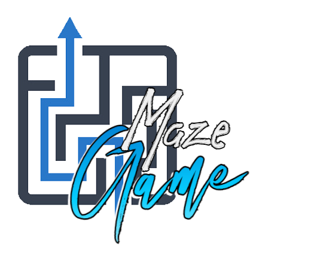

# MazeGame

A simple maze game. Each level has a different maze and a different solution.

## Introduction
The goal of this project is to learn how to generate a maze and solve it. (The solver has not been implemented yet.) 

----

Feel free to give your opinion about the code and on what it can be improved